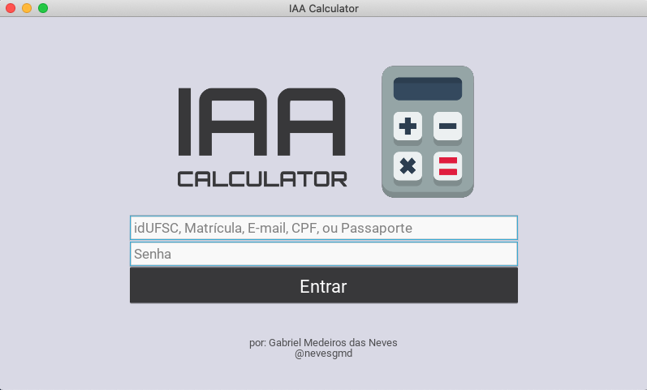
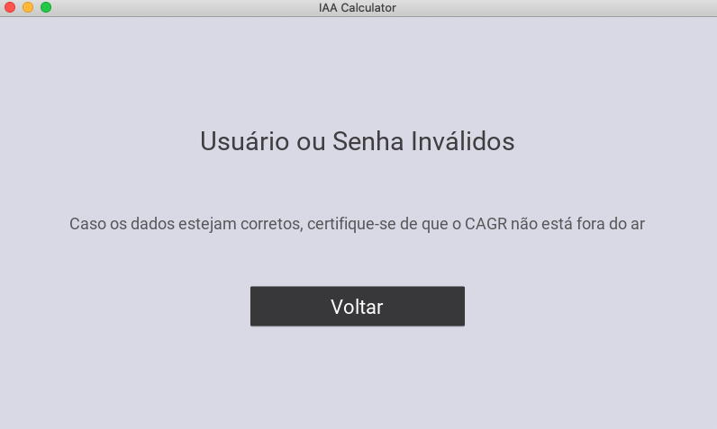
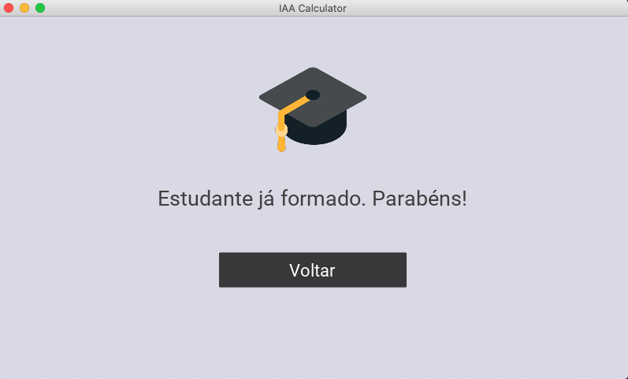
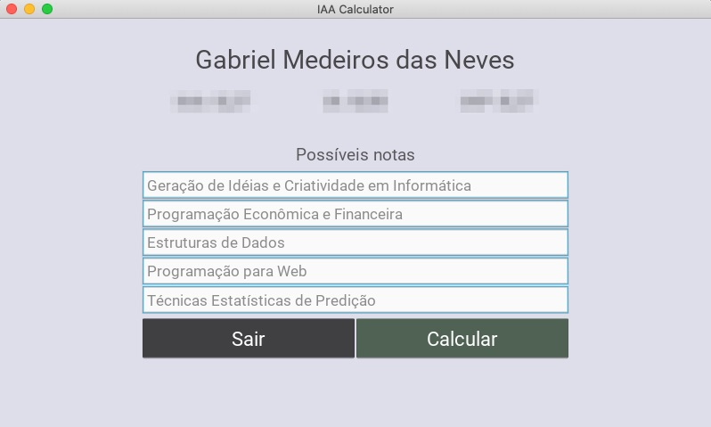
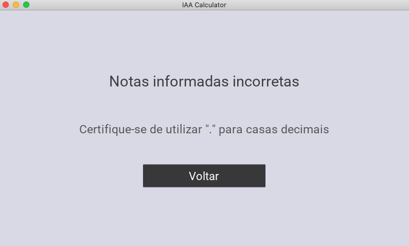
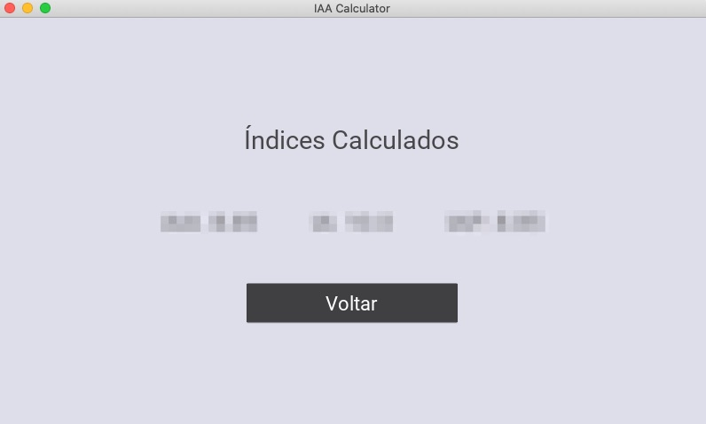

# Calculadora de IAA para Estudantes da UFSC

Após alguns comentários de estudantes reclamando sobre o cálculo do futuro IAA com as notas esperadas do semestre, decidi criar uma calculadora que facilite esse processo, uma vez que os índices de desempenho são relevantes para conseguir bolsas, estágios e oportunidades de intercâmbio.

# Sumário
1. [Padrão de Commits](#commits)
2. [Rodando o Programa](#running)
3. [Não Consigo Instalar as Bibliotecas Necessárias](#kivyerror)
4. [Interface](#screens)
5. [Agradecimentos](#agradecimentos)
6. [Contato](#contact)
7. [Licença](#license)

## Padrão de Commits
Antes de tudo, gostaria de dizer que esse projeto é feito de estudantes para estudantes, portanto, sinta-se livre para contribuir. Apenas certifique-se de seguir o padrão de commits adotado neste projeto [explicado neste site](https://udacity.github.io/git-styleguide/), em inglês.  
Caso tenha problemas para entender o padrão, entre em [contato](#contact) diretamente comigo.

## Rodando o Projeto
Todo o projeto foi desenvolvido em Python, o qual pode ser instalado [aqui](https://www.python.org/downloads/).  
  
Após baixar/clonar todos os arquivos deste repositório em seu computador, siga os seguintes passos:

1. Acesse o diretório do projeto usando o `terminal` (MacOS, Linux) ou o `cmd` (Windows)
2. Instale os requisitos do projeto com a seguinte linha de código `pip install -r requirements.txt`.
3. Rode o programa através do arquivo **iaa_calculator.py** com o seguinte código `python3 iaa_calculator.py`

## Não Consigo Instalar as Bibliotecas Necessárias
Se você está tentando baixar as bibliotecas necessárias através do arquivo **requirements.txt** e não está conseguindo, muito provavelmente isto está acontecendo devido à versão do Python instalado em seu computador.  
Infelizmente, o Kivy ainda não suporta versões do Python posteriores à **3.8**. No entanto, solucionar este problema é bem simples:
1. Acesse o diretório do projeto usando o `terminal` (MacOS, Linux) ou o `cmd` (Windows).
2. Instale Kivy com a seguinte linha de código: `pip install kivy[base] kivy_examples --pre --extra-index-url https://kivy.org/downloads/simple/`
3. Instale Robobrowser: `pip install robobrowser`
3. Instale Werkzeug: `pip install werkzeug`

## Interface  
1. Página de Login  

  
2. Página de Login Inválido  

  
3. Página de Usuário já Formado  

  
4. Página Inicial Borrada (ocultando índices do estudante)  

  
5. Página de Notas Informadas Inválidas  

  
6. Página de Notas Calculadas Borrada (ocultando notas calculadas)  

  

## Agradecimentos
Gostaria de agradecer ao Gustavo Zambonin, pois seu [script de calculo do IAA](https://github.com/zambonin/ufsc-iaa-calc) foi inspiração para este projeto e ao Tim do canal [Tech With Tim](https://www.youtube.com/channel/UC4JX40jDee_tINbkjycV4Sg) pela  disponibilização gratuita de um curso introdutório ao Kivy.

## Contato
Caso possua qualquer dúvida ou necessite de ajuda para rodar o projeto, entre em contato diretamente comigo através do meu e-mail: gmedeirosneves@gmail.com

## Licença
Este projeto está sobre a licença GNU GPL v3.0 - cheque o arquivo [LICENSE](LICENSE) para mais detalhes.

